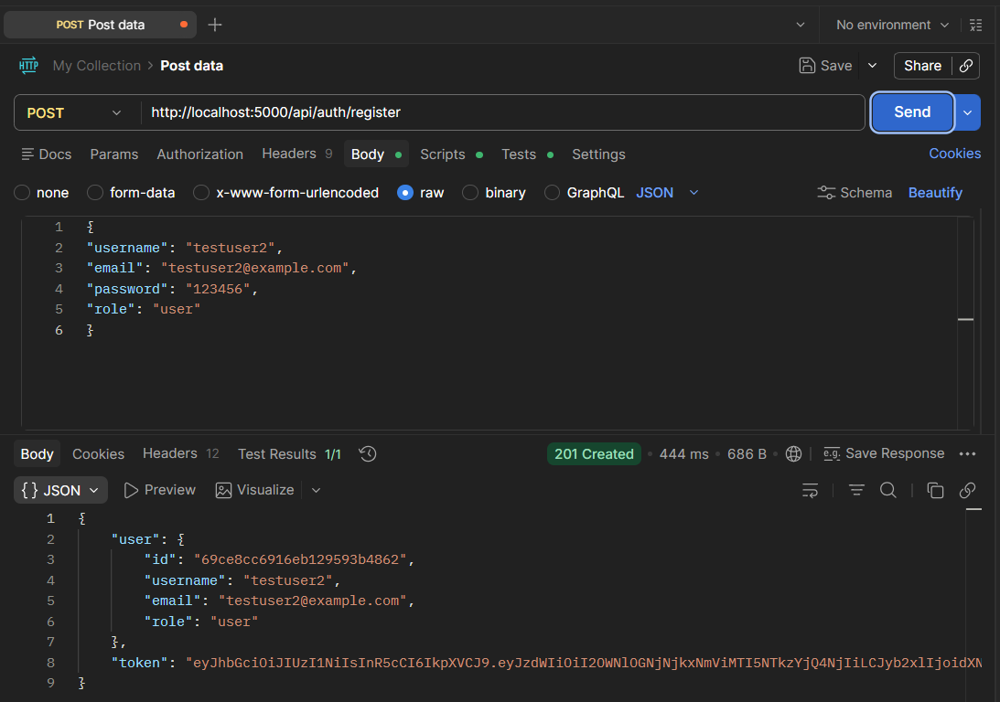
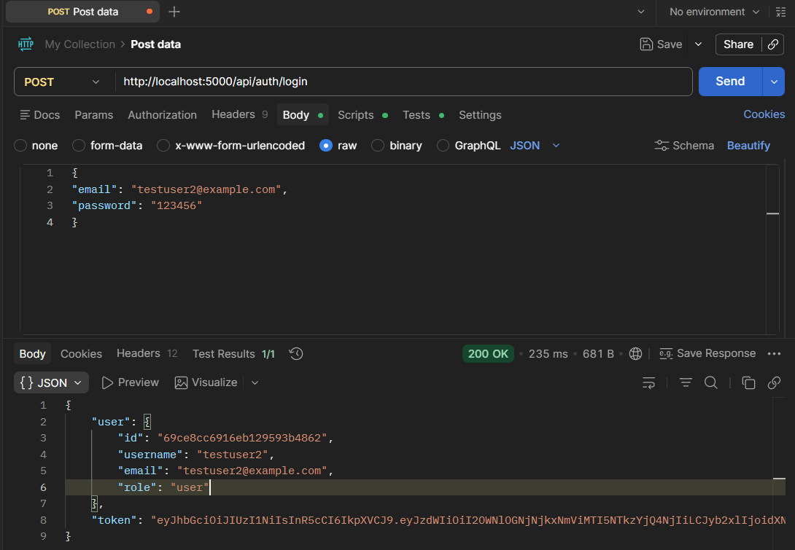
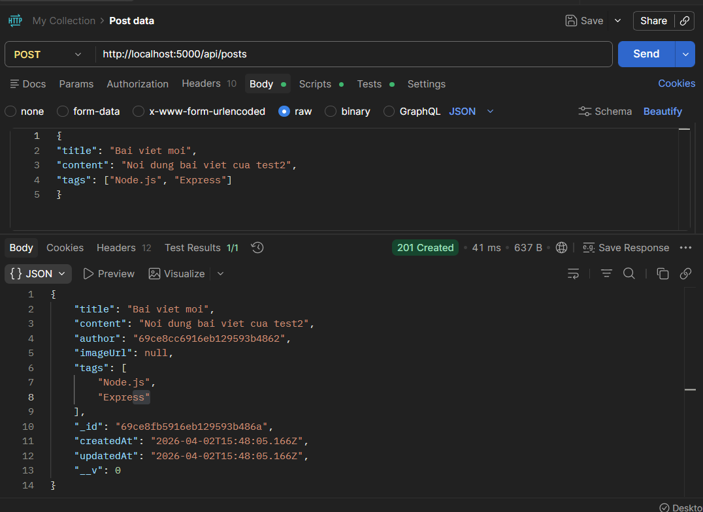
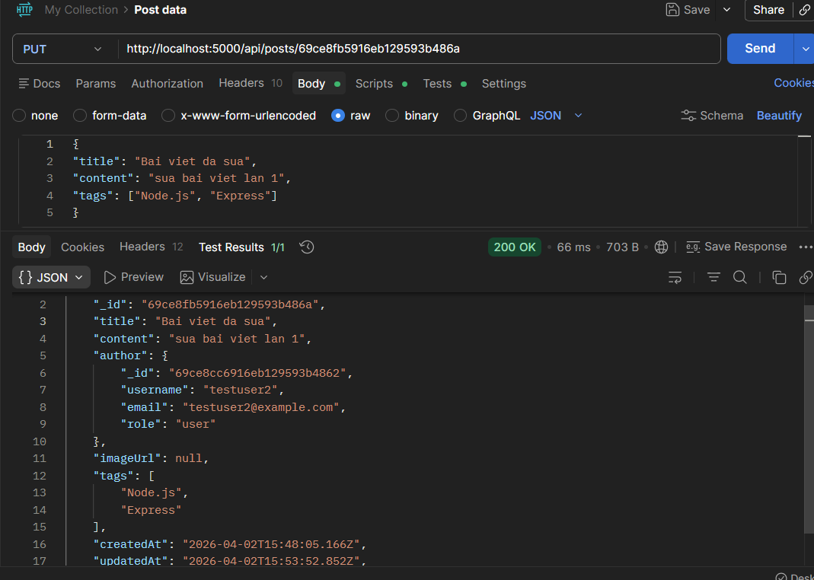
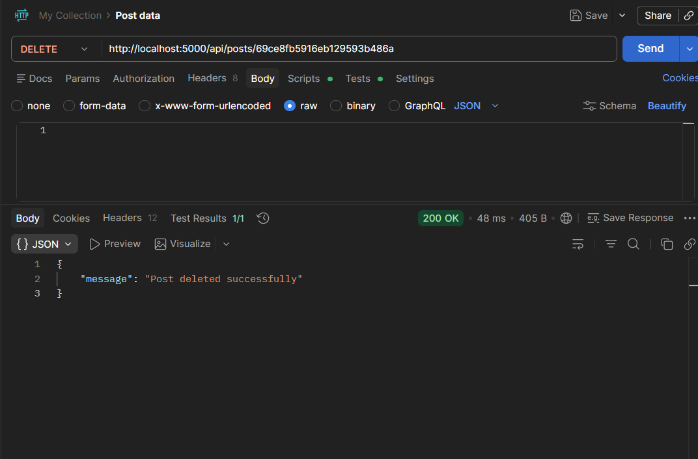
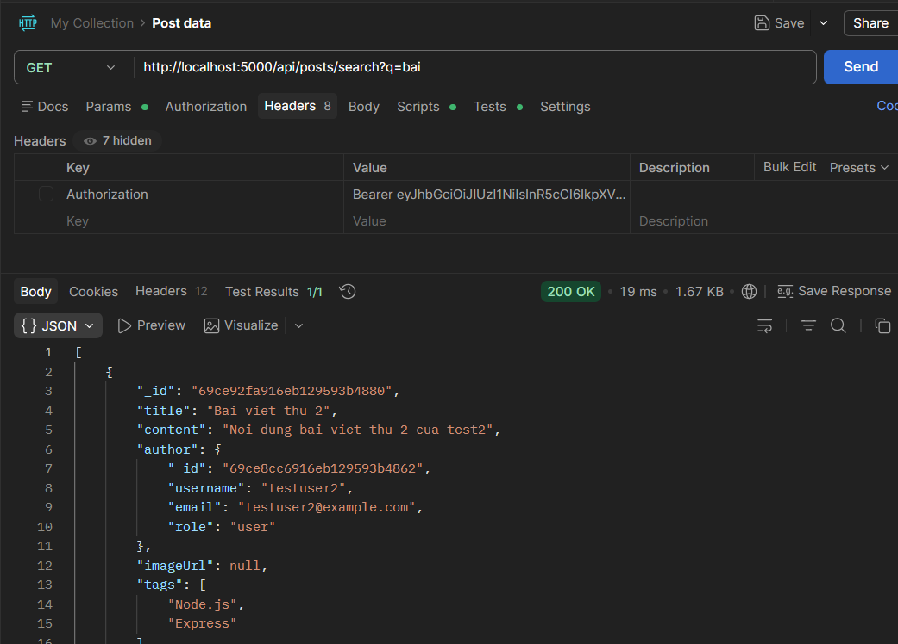
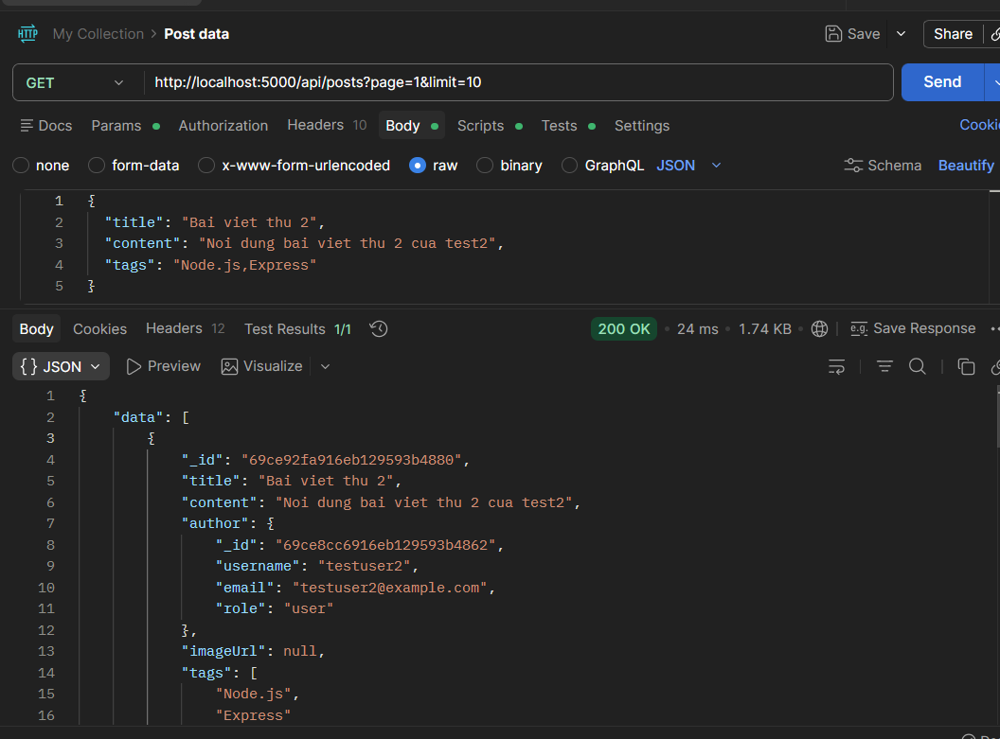

# Bao cao ngan - RESTful Blog API (ban toi thieu)

## 1. Thong tin chung

- Ho ten: Nguyen Tuan Anh
- Lop: WD1113
- Link GitHub repository: https://github.com/ngtuananh2/nodejs_asig
- Ten bai: Xay dung RESTful Blog API voi Authentication & Authorization

## 2. API endpoints (tom tat)

### Auth

- POST /api/auth/register
- POST /api/auth/login

### Post

- GET /api/posts?page=1&limit=10
- GET /api/posts/:id
- POST /api/posts
- PUT /api/posts/:id
- DELETE /api/posts/:id
- GET /api/posts/my-posts
- GET /api/posts/search?q=keyword&tag=Node.js

## 3. Thiet ke 3 lop

- Routes: khai bao endpoint
- Controllers: nhan request, tra response
- Services: xu ly nghiep vu (auth, owner/admin, pagination, search)
- Repositories/Models: truy van MongoDB

## 4. Mo ta cach van hanh he thong

1. Nguoi dung dang ky/dang nhap qua /api/auth, he thong tra ve JWT token.
2. Token duoc gui qua header Authorization: Bearer <token> khi goi cac API can dang nhap.
3. Khi tao/sua/xoa bai viet, middleware auth se kiem tra token.
4. Service se kiem tra quyen owner/admin truoc khi cho phep update/delete.
5. Du lieu duoc luu trong MongoDB gom 2 collection chinh: users va posts.
6. Anh bai viet duoc upload vao thu muc public/uploads va luu duong dan imageUrl trong post.

## 5. Ket qua test Postman (chen anh vao day)

### 5.1 Register thanh cong

### 5.2 Login thanh cong

### 5.3 Tao bai viet thanh cong (khong anh)

### 5.4 Tao bai viet co upload anh

[Chen anh 4: POST /api/posts form-data + image + imageUrl trong response]

### 5.5 Update/Delete dung quyen

### 5.6 Search va Pagination

## 6. Ket luan

Du an da hoan thanh cac yeu cau chinh cua de bai gom authentication, authorization,
CRUD bai viet, upload anh, validation, pagination, search va error handling.
